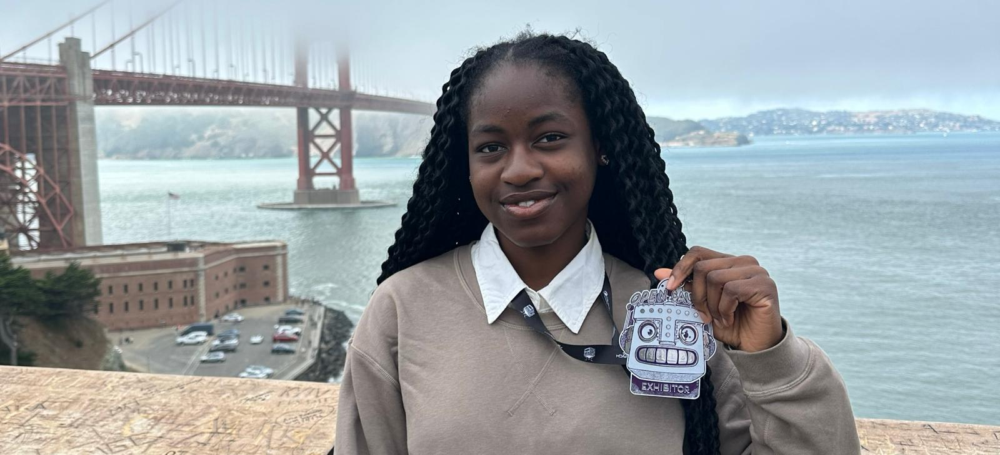

 

Hello! I'm Funmilayo, and yes! I DID exhibit at Open Sauce 2026! :D 
 

In my free time? I hack — I make hardware, machine learning, and a few software projects. Feel free to message me; I'm curious and would love to hear about whatever projects you're working on! Here are some of mine you should check out!

### Projects I'm currently working on

- Macropad - https://github.com/Dee-24r/Dee-pad_clean
- Split keyboard - https://github.com/Dee-24r/Edge
- Custom RP2040 Devboard https://github.com/Dee-24r/MyDevboard

### Couple of finished personal projects
- Blinky board - https://github.com/Dee-24r/GoBlinky
- 2D platformer game - https://hack-girl.itch.io/dash - [repo](https://github.com/Dee-24r/Dash)
- Personal website - https://dee-24r.github.io/FunmilayoOshebeyo/ - [repo](https://github.com/Dee-24r/FunmilayoOshebeyo)

### Past Hackathon Projects
- Turret with Face Recognition - https://github.com/Dee-24r/outpost_turret
- Robot that picks up cans - https://github.com/Dee-24r/The-Incredible-Rockasis
- AI study tool - https://github.com/Dee-24r/clarify
- Interactive website + novel + games - https://github.com/Dee-24r/Sleepy_sleepover
- Vibe coded hardware because that was what was expected :( https://github.com/Dee-24r/seb-hack

I'd love to hear from you! Feel free to chat!
